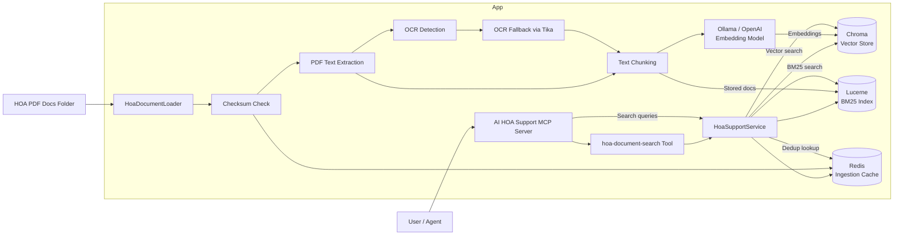

# AI HOA Support

AI HOA Support is a Spring Boot application that helps answer HOA policy questions by searching governing documents with a hybrid retrieval pipeline. It loads PDF documents from a configured folder, extracts their text, chunks and embeds the content, indexes the same chunks in Lucerne, and exposes the result through a Model Context Protocol (MCP) tool that an AI agent can call when answering resident or board-member questions.

The application is designed to support queries such as parking rules, pet policies, architectural standards, quiet-hours guidelines, fine enforcement, and document lookups based on the association's official governing documents.

## Architecture diagram



## What this application accomplishes

- Reads HOA policy PDFs from a configurable folder
- Extracts document text using Spring AI + Tika
- Splits content into searchable chunks
- Generates embeddings with an Ollama embedding model
- Stores vectors in Chroma and BM25 documents in Lucerne
- Uses Redis to skip duplicate PDF ingestion
- Falls back to OCR for image-based PDFs
- Exposes an MCP tool named `hoa-document-search`
- Lets an agent answer HOA questions grounded in actual governing documents rather than general knowledge

## MCP integration

This server exposes a `hoa-document-search` tool that can be used by an external AI agent or client to retrieve relevant HOA policy passages from the vector store.

The flow is:
- the agent queries the tool with a policy-related question
- the service searches Chroma for semantic matches and Lucerne for BM25 matches
- the service fuses the two result sets before answering
- the tool returns matching document excerpts
- the agent uses those excerpts to answer the user with document-backed guidance

## Technologies used

- Java 21
- Spring Boot 4.1.0
- Spring AI
- Spring AI MCP Server
- Ollama for embeddings
- Chroma vector database
- Lucerne / Apache Lucene for BM25 search
- Redis for ingestion deduplication
- Apache Tika for PDF text extraction
- Apache PDFBox for OCR detection
- Maven

## Configuration

The application uses the following environment/config values:

```yaml
hoa:
  document-folder-path: ${HOA_DOCUMENT_FOLDER_PATH:}
  document-loading-enabled: ${HOA_DOCUMENT_LOADING_ENABLED:false}
  ocr-enabled: ${HOA_OCR_ENABLED:true}
  ocr-language: ${HOA_OCR_LANGUAGE:eng}
  ocr-tesseract-path: ${HOA_OCR_TESSERACT_PATH:}
  ocr-tessdata-path: ${HOA_OCR_TESSDATA_PATH:}
lucene:
  index:
    path: ${LUCENE_INDEX_PATH:target/lucene-index}
spring:
  data:
    redis:
      host: ${REDIS_HOST:localhost}
      port: ${REDIS_PORT:6379}
      password: ${REDIS_PASSWORD:}
```

Set the folder with HOA PDFs and enable document ingestion when needed. Redis stores processed file checksums, and OCR can be tuned or disabled through the HOA OCR settings.

## Sample prompts

Use prompts like the following in the agent:

- "What are the HOA rules for parking commercial vehicles?"
- "Are pets allowed in the community?"
- "What is the policy for architectural changes or exterior modifications?"
- "What are the rules around noise complaints and quiet hours?"
- "What does the CC&R say about leasing or rental restrictions?"
- "What are the fines and enforcement procedures for rule violations?"

## Project structure

```text
ai-hoa-support/
├── src/
│   ├── main/
│   │   ├── java/
│   │   │   ├── com/learning/
│   │   │   │   ├── init/
│   │   │   │   └── services/
│   │   └── resources/
│   │       └── application.yaml
├── hoa.agent.md
├── pom.xml
├── README.md
└── mvnw
```

## Summary

This project turns HOA governing documents into a searchable, agent-friendly knowledge layer. By combining document ingestion, embeddings, vector search, Lucerne BM25 search, Redis-backed deduplication, OCR fallback, and MCP tooling, it gives an AI agent a reliable, document-backed way to answer HOA policy questions.
